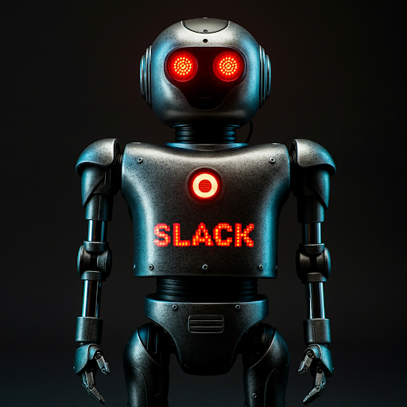
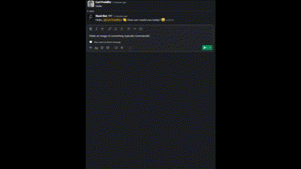
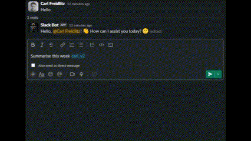

# slack-bot
A python based slack bot with various functionalities.

Meet Slack Bot. This is just our default (ominous) image. Feel free to use it as your Slack Bot icon, or another one of your choice!
 

## Features
*   **Main Features:**
    * Chat: Talk freely with the bot.<br> 
    <br> 
    Prompt: `Tell me three facts about Greenland!`

    * Image Generation: Ask the bot to generate an image.<br> 
    <br> 
    Prompt: `Make an image of something typically Greenlandic`

    * Web Search: Ask the bot to look something up for you.<br> 
    <br> 
    Prompt: `Can you look up what the population of Greenland is?`

    * Summarisation: Asking the model to summarise anything from company terms, what a user has said to a general summarisation of a given time frame in all tagged channels, as long as the bot has access to them. The bot has default access to all public channels it has been invited to. Private channels requires an extra slash command as a privacy measure.<br> 
    <br> 
    Prompt: `Summarise this week #channel`

    * Create a report: The bot can help you create a report or at least the rough edges of one by using an agentic workflow between the user and the agents to achieve a result.<br> 
    
    Prompt: 
*   **Slash Commands:**
    *   `/ai-search-enable`: Using this command in a private channel allows the bot to store the channel history for RAG (Retrieval-Augmented Generation) using the summarisation feature.
    *   `/ai-search-disable`: Using this command in a private channel disallows the bot from storing the channel history for RAG (Retrieval-Augmented Generation) using the summarisation feature.
    *   `/ai-bug-report`: Using this command adds a bug report visible to the bot admin(s) via the MongoDB compass.
    *   `/ai-feature-request`: Using this command adds a feature request visible to the bot admin(s) via the MongoDB compass.
*   **Shortcuts:**
    * `ai-create-report`: Using this shortcut causes the bot to enter the create report stage where it will help you out in a thread until completion or if an inactivity timer is reached.
*   **Event Handling:**
    *   Responds to `@mentions` in any chat it's a member of. Not required when talking to the bot in private messages.

## Prerequisites
*   [Docker](https://www.docker.com/products/docker-desktop) installed and running.
*   A Slack workspace where you have permissions to install apps.
*   Create and fill in a `.env` file using the pre-existing `.env.example` file as a template. While the bot won't necessarily break because you're missing an API key is true in some cases, the functionalities will be limited. Some of the used API keys are accessible for free within limited usage and the Slack API keys will provided in the `Slack API` guide below.

## Slack API
1. Go to the URL `https://api.slack.com/apps` or click here: [API](https://api.slack.com/apps).

2. Press the button `Create New App`.

3. Select `From a manifest`.

4. Press `Select a workspace` and choose the workspace the slack-bot will be used for from the dropdown menu, then press `Next`.

5. You'll now be in the `Create app from manifest` section. Make sure `JSON` is selected and feel free to paste and use our manifest as printed below to save you some time and energy. Also feel free to change the name of the bot or any other personal preference/ description. Once finished, proceed by pressing `Next`. 

    ```json
    {
        "display_information": {
            "name": "slack-bot",
            "description": "You can message me directly—no need to @ me! Tag channels with #channel for private summaries and keep the main channels clutter-free.",
            "background_color": "#3D3D3D",
            "long_description": "1. Summarisation\r\nGet summaries of any Slack channel for specific time periods, such as:\r\n\"Q2 this year\"\r\n\"Week 13 this year\"\r\n\"This month\"\r\n\"Around May this year\"\r\nTry it out and stay up-to-date effortlessly!\r\n\r\n2. Image Generation\r\nRequest the bot to create images based on your prompts. Let your imagination run wild!\r\n\r\n3. Web Search\r\nAsk the slack-bot to search the web for any information you need, directly from Slack.\r\n\r\n4. Agentic Report Writer\r\nUse the shortcut \"ai-create-report\". It will help you write a report about any subject and you work side by side giving each other the required information to accomplish the task.\r\n\r\nAdditional Features:\r\nYou can message the slack-bot directly to keep channels free from summarisation clutter, etc.\r\nUse /ai-bug-report to report issues you find!\r\nUse /ai-feature-request to suggest new features you'd like!\r\nUse /ai-enable-search to permit the bot to save and summarise chat history!\r\nUse /ai-disable-search to remove the bots permission to save and summarise chat history (default for private channels).\r\n\r\nStay productive and explore the bot's capabilities!"
        },
        "features": {
            "bot_user": {
                "display_name": "Slack Bot",
                "always_online": true
            },
            "shortcuts": [
                {
                    "name": "ai-create-report",
                    "type": "global",
                    "callback_id": "create_report",
                    "description": "Start the Agentic Workflow of writing a document of your choice."
                }
            ],
            "slash_commands": [
                {
                    "command": "/ai-bug-report",
                    "description": "Give us your bug feedback!",
                    "usage_hint": "Bug when doing...",
                    "should_escape": false
                },
                {
                    "command": "/ai-feature-request",
                    "description": "What features do you want?",
                    "usage_hint": "I would like...",
                    "should_escape": false
                },
                {
                    "command": "/ai-search-enable",
                    "description": "Allow summarisation and chat history backup of the target channel",
                    "should_escape": false
                },
                {
                    "command": "/ai-search-disable",
                    "description": "Disallow summarisation and chat history backup of the target channel",
                    "should_escape": false
                }
            ]
        },
        "oauth_config": {
            "scopes": {
                "bot": [
                    "channels:history",
                    "channels:read",
                    "chat:write",
                    "commands",
                    "files:read",
                    "files:write",
                    "groups:history",
                    "groups:read",
                    "im:history",
                    "im:read",
                    "im:write",
                    "links:read",
                    "reactions:read",
                    "reactions:write",
                    "team:read",
                    "users:read",
                    "links:write"
                ]
            }
        },
        "settings": {
            "event_subscriptions": {
                "bot_events": [
                    "message.channels",
                    "message.groups",
                    "message.im",
                    "reaction_added",
                    "reaction_removed"
                ]
            },
            "interactivity": {
                "is_enabled": true
            },
            "org_deploy_enabled": false,
            "socket_mode_enabled": true,
            "token_rotation_enabled": false
        }
    }
    ```

6. You'll now be at the confirmation stage `Review summary & create your app` Where you can have a quick look before you create the bot by pressing `Create`.

7. Great, now you've created your bot, but we're not done just yet, but almost! Under `Settings`, head to `Basic Information`, and under `App-Level Tokens` press `Generate Token and Scopes`. Paste the token name as `SLACK_BOT_TOKEN`, then press `Add Scope` and select the scope `connections:write` for it, then press `Generate`. When you've generated it, make sure to copy the API key for example with the `Copy` button, then pressing `Done`. Paste the API key in your `.env` file within the `SLACK_BOT_TOKEN` variable.
You can also set your bot's profile picture here if you want while you're at it.

8. Now, under `Features`, press `App Home` and under `Show Tabs` tick the box for `Allow users to send Slash commands and messages from the messages tab`.

9. Now it's time for our second and final Slack API key. We head back to `Settings` and press `Install App`. Press the button `Install to ai-bot`, continue by pressing `Allow`, then finally make sure to copy the `Bot User OAuth Token` API key with the `Copy` button and paste it into the `SLACK_BOT_TOKEN` variable in your `.env` file.

10. Great! Your bot should now be configured properly with Slack. We just got to connect it with our source code and the local database!

## Installation
1. Clone the repository manually or use GitHub Desktop then make sure that you are in the `slack-bot` code's current directory (cd) on your machine using a terminal:

    ```bash
    git clone https://github.com/slackbotai/slack-bot.git
    cd slack-bot
    ```

2. Create a virtual environment within the project:

    This and the next step are not required, but recommended if you plan on modifying the code and or the requirements.txt file. Else skip to step 4.

    ```bash
    python -m venv venv
    ```

3. Activate the virtual environment:

    ```bash
    ./venv/Scripts/activate
    ```

4. Build the bot application with docker-compose:

    ```bash
    docker-compose up --build
    ```

    This will make sure you get the correct and compatible versions of python, requirements and MongoDB as required for the application. For future restarts without any added changes, `Left Control + C` in the terminal or using the Docker Desktop down followed by `docker-compose up` or using the Docker Desktop will suffice.

    The code is set to re-run and download all new channels it can access every day at `00:00` (midnight). This can be done manually through a the process right above if you want it done asap.

## MongoDB Compass
While it's not necessary, we recommend using the MongoDB Compass for ease of access to see which channels are accessed for the summarisation, both public that the bot is invited to and private channels that it's A; invited to and B; allowed to summarise in through the slash command `ai-search-enable`. With the Compass you can also easily see user bug reports and feature requests.

If it's something you wish to use, you can head to `https://www.mongodb.com/products/tools/compass` or click the link here: [Compass](https://www.mongodb.com/products/tools/compass).

1. Once you have the compass up and running, press `Add new connection`. The `URI` should be `mongodb://localhost:27017` as well as in the `.env` file. For the name, that choice is up to you. Continue by pressing `Save & Connect`.

2. And now you're done with that easy process! All downloaded channels are found in the `Channels` volume. All other information is found in the `Information` volume. There we have another `Channels` that is just further information about all channels accessed for summarisation. The `Summarisation` section includes all private channels that the bot is in and has access to via the `ai-search-enable` slash command. Here you will also find `ThreadStorage`, `URLStorage`, `BugReports` and `FeatureRequests` as the bot is used and there is data to store.

## How to Contribute
Please follow the guidelines for contributing to this project.
Please see our [Contributing Guidelines](HOW_TO_CONTRIBUTE.md) for details on
how to get involved.

## License
This project is licensed under the MIT License.